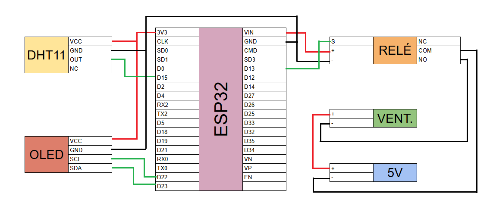

# SmartVent ESP32

## Descripción
SmartVent ESP32 es un sistema de ventilación inteligente basado en la implementación de un microcontrolador ESP32, diseñado para controlar un ventilador en función de la temperatura y humedad ambiente. El sistema permite el monitoreo y la configuración remota a través del protocolo MQTT, facilitando la automatización de la ventilación en distintos entornos.

## Componentes
- **Microcontrolador:** ESP32
- **Sensores:** DHT11 
- **Actuador:** Ventilador controlado mediante un relé de 5V
- **Visualización:** Display OLED 
- **Conectividad:** Conexión wifi y comunicación MQTT con broker Mosquitto
- **Interfaz gráfica:** Dashboard en Node-RED

## Circuito
### Esquemático:


### Conexiones:


## Funcionamiento
1. El sensor DHT11 mide la temperatura y la humedad.
2. El display OLED muestra los datos sensados.
3. Si la temperatura supera los 25°C o la humedad es mayor al 65%, el ventilador se enciende.
4. El microcontrolador se conecta a la red wifi.
5. El sistema envía los datos al broker MQTT y los muestra en la interfaz gráfica (Node-Red).

## Requerimientos
- Hardware con las conexiones descriptas.
- Visual Studio Code instalado.
- PlatformIO instalado en Visual Studio Code.
- Mosquitto broker funcionando en la red local.
- Node-Red instalado con el dashboard activado.

## Configuración
1. **Clonar el repositorio:**
   ```sh
   git clone https://github.com/victoriafaiola/Sistema-de-Ventilacion.git
   ```
2. **Compilar y subir el firmware al ESP32:**
3. **Configurar Node-RED:**
   - Verificar la conexion wifi.
   - Verificarr la conexion con el broker Mosquitto.
   - Importar el archivo json en Node-Red.
   - Acceder a la dashboard.

## Dashboard en Node-RED
La interfaz permite:
- Visualizar temperatura y humedad en tiempo real.
- Visualizar la evolución de temperatura y humedad.
- Visualizar el estado del ventilador.